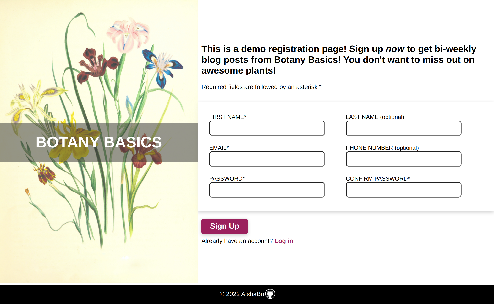
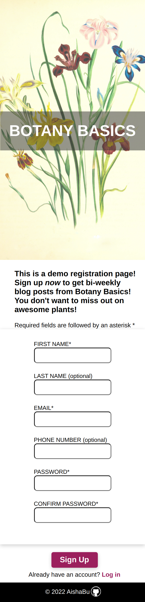

# Sign-up-Form

<table>
    <tr>
    <td></td>
    </tr>
</table>

### Description
This sign up form was created for the Sign Up Form assignment in the Odin Project. The assignment is to make a fully functional sign up form using HTML, CSS, and JavaScript. I did the form validation by using HTML5 form validation attributes on the input fields,using JavaScript's Contraint Validation API to customize error messages and using JavaScript to validate the entire form before it is submitted. The form is fully responsive for desktop, mobile, and tablet devices. 

#### Desktop Devices
<table>
    <tr><td></td></tr>
</table>

### Mobile and Tablet Devices
<table>
    <tr>
    <td>
        
        
    </td>
    </tr>
</table>

### Live Site
[Botany Basics Form](https://aishabu.github.io/sign-up-form/)

### Built With 
HTML  
CSS 
JavaScript 

### Features
Accepts letters and numbers for first and last name 
 
Accepts a valid email address format(example@example.com) 
 
Accepts a ten digit number in correct format (123-456-7890) 
 
Accepts password that uses regex pattern -at least 1 capitalized letter, at least one lowercase letter,
  at least one special character, at least 1 number, and a minimum of 8 characters 
 
Checks that passwords match regex pattern using JavaScript 
 
Checks that password and confirmation passwords match on input and before form is submitted 
 
Shows error messages and prevents form submission if any fields are invalid 
 

### Sources
#### Form Image &  Github Icon 
Flowers Image by <a href="https://unsplash.com/@britishlibrary?utm_source=unsplash&utm_medium=referral&utm_content=creditCopyText">British Library</a> on <a href="https://unsplash.com/s/visual/a3c6dc8c-8bfb-4bf6-a1b4-8694b15e83d7?utm_source=unsplash&utm_medium=referral&utm_content=creditCopyText">Unsplash</a>
  
<a href="https://www.flaticon.com/free-icons/github" title="github icons">Github icons created by Laisa Islam Ani - Flaticon</a>

#### Odin Project
[Odin Project - Sign Up Form Project](https://www.theodinproject.com/lessons/node-path-intermediate-html-and-css-sign-up-form)

